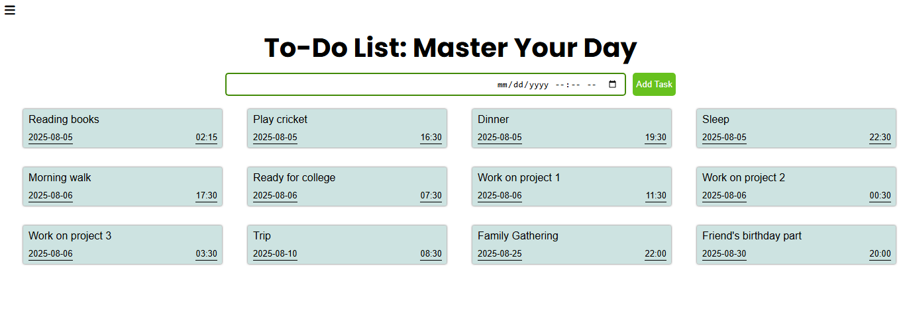

# 📝 To-Do List App

A simple, clean, and responsive To-Do List application that allows users to manage daily tasks efficiently. Add, complete, delete, and view task history – all stored using your browser's local storage.

 

## 🚀 Features
- Add new tasks
- Mark tasks as completed
- Delete tasks
- View history of completed and deleted tasks
- Clear task history
- Responsive and intuitive design

 

## 🛠️ Built With
- HTML
- CSS
- JavaScript (Vanilla)

 

## 📷 Screenshot

 

 💻 How to Use
- Clone or download the repository.
- Open the `index.html` file in any modern web browser (just double-click or right-click → **Open with > Browser**).
- Start managing your tasks!
 

## 📄 License
This project is licensed under the MIT License – see the [LICENSE](LICENSE) file for details.

